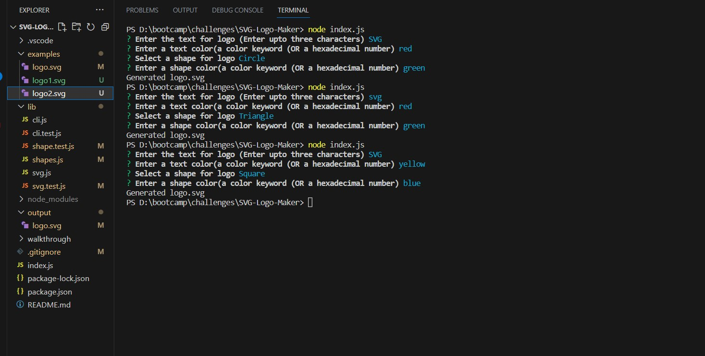
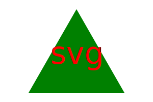

# SVG-Logo-Maker

## Description

This SVG logo maker is command line application that runs with node.js and allows user to dynamically generate "logo.svg" file in output folder with svg, text and shape html tag based upon the input entered in regard to questions prompted for logo text, text color , shape of logo and shape color. Shape and text colors can be chosen using color keywords or hexadecimal numbers. Some samples are shown in examples folder

## Table of Contents

- [Installation](#installation)
- [Usage](#usage)
- [Contribution](#contribution)
- [Credits](#credits)
- [Contact Information](#contact-information) 

## Installation

A little intro about the installation.

1. Clone the Repository from GitHub
   ```
   git clone git@github.com:sakshiarora04/SVG-Logo-Maker.git
   ```
2. Install Node.js then Open terminal and run command
   ```
   npm init
   ```
3. To install required dependencies, run the following command :

   ```
   npm inquirer@^8.2.4

   npm install jest@24.9.0 --save-dev
   ```

4. In the end, run command-
   ```
   node index.js
   ```

## Usage

When user runs node index.js command after opening integrated terminal on right clicking the repo folder, the application prompts the series of questions related to logo name, shape, shape color and text color using the inquirer package.

The application then takes all responses and will dynamically generate high quality SVG logo file with extension .svg and message will be displayed on console as 'Successfully generated logo.svg'. If user enters logo name of size more than 3 characters then it will show message as 'Logo text must contain less than or equal to 3 characters' and will not let user to skip current question until editing the text name or quitting.

User can enter hexadecimal or color keyword value in shape or text color question. If user put some invalid color keyword or hexadecimal number less than 6 digits then it will display message on screen as 'Please enter valid color' and will allow the user to edit it without running index.js again. 

After answering all questions, it will generate logo and display 'Generated logo.svg' on screen.

Link to walkthrough video in google drive:

https://drive.google.com/file/d/1jfaUaANQghFULbeyfN79AHDVN1stvT6c/view?usp=sharing

Link to walkthrough video in Screencastify:

https://app.screencastify.com/manage/videos/ZGHbm7vX3o9hEQghwCdu

The following images show the application's appearance and functionality :

* Command line



* Sample logos





* Walkthrough


## Contribution

To contribute to this application, email me at sakshiarora245@gmail.com.
Here are the steps needed for doing that:

- Fork the repo
- Create a feature branch (git checkout -b NAME-HERE)
- Add stages (git add .)
- Commit your new feature (git commit -m 'Add some feature')
- Push your branch (git push)
- Create a new Pull Request

After reviewing, your feature branch will be merged.

## Credits

References:

https://jestjs.io/docs/28.x/using-matchers

## Contact Information

Github Username: [sakshiarora04](https://github.com/sakshiarora04)

Email id: sakshiarora245@gmail.com
